## Burp Suite

Burp Suite（简称 Burp）是一款 Web 安全领域的跨平台工具，基于 Java 开发。它集成了很多用于发现常见 Web 漏洞的模块，如 Proxy、Spider、Scanner、Intruder、Repeater 等。所有的模块共享一个能处理并显示 HTTP 消息的扩展框架，模块之间无缝交换信息，可以大大提高效率。

### Proxy 代理模块

代理模块是 Burp 的核心模块，自然也会是我们使用最多的一个模块。它主要用来截获并修改浏览器、手机 App 等客户端的 HTTP/HTTPS 数据包。

要想使用 Burp，必须先设置代理端口。依次选择 Proxy → Options → Proxy Listeners → Add 增加代理，如图 1-1 所示。

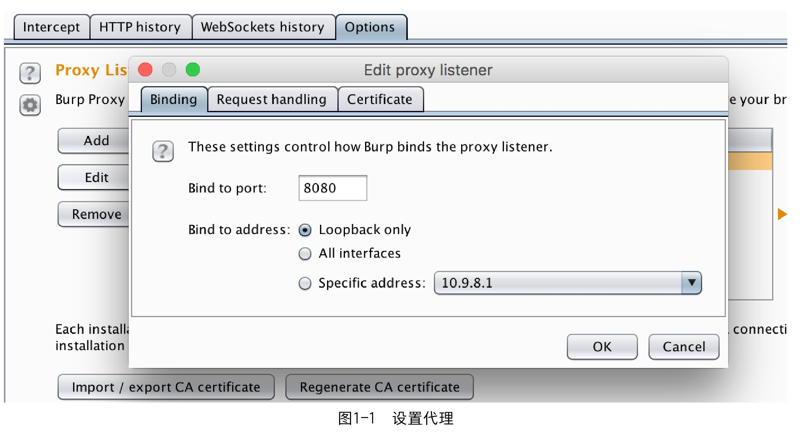

在 Bind to port 一栏内填写侦听的端口，这里以 8080 端口为例。如果要在本机使用，可以将 Bind to address 设置为 Loopback only ；如果要让局域网内的设备使用代理，则应该选择 All interfaces。点击 OK 按钮后勾选 Running，如图 1-2 所示。

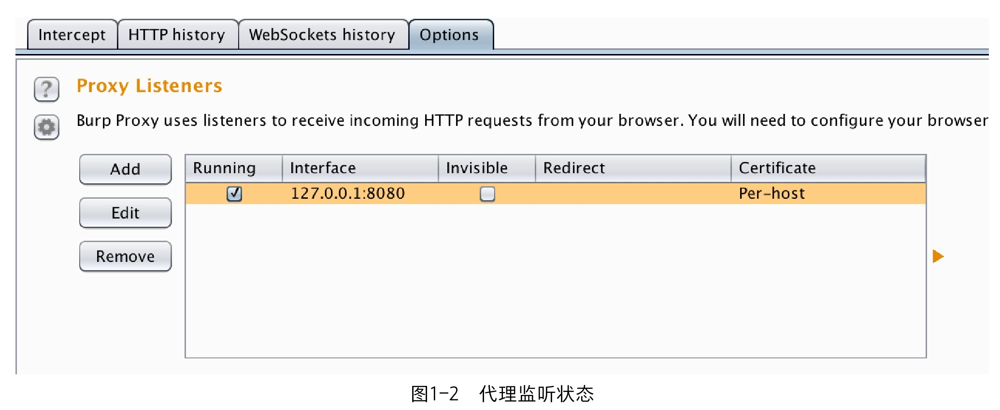

下面以 IE 浏览器为例，在浏览器上依次选择 Internet 选项→连接→局域网设置，然后在“代理服务器”一栏中填写前文配置的 Burp 代理 IP 地址和端口，配置界面如图 1-3 所示。

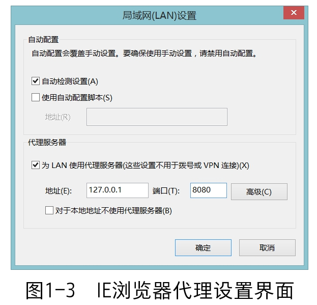

设置完成后就可以通过Burp代理来抓取IE浏览器的数据包了，如果使用的是Firefox或者是Chrome浏览器，则可在相应浏览器的配置项或插件中进行设置。

不过，以上方法会显得十分复杂，而且当我们不需要代理或需要切换代理时会非常不方便。这时候可以在浏览器中添加一些附加组件（在接下来的小节中将会介绍），从而可以方便地进行代理切换。

接下来，在 Proxy → Intercept 选项卡下设置 Intercept is on，这样就能截获浏览器的数据包并进行修改等操作了。如果设置 Intercept is off，则不会将数据包拦截下来，而是会在 HTTP history 中记录该请求。

接下来，在 Proxy → Intercept 选项卡下设置 Intercept is on，这样就能截获浏览器的数据包并进行修改等操作了。如果设置 Intercept is off，则不会将数据包拦截下来，而是会在 HTTP history 中记录该请求。

在数据包内容展示界面上单击右键，可以将这个数据包发送给 Intruder、Repeater、Comparer、Decoder 等模块，如图 1-4 所示。

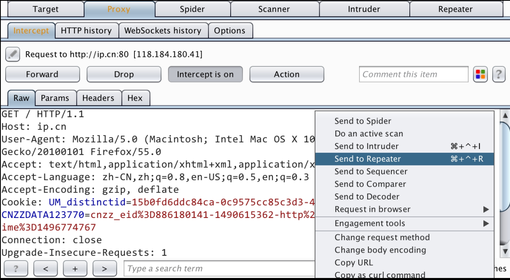

### Repeater 重放模块

在需要手工测试HTTP Header中的Cookie或User-Agent等浏览器不可修改的字段是否存在注入点，以及需要发现复杂的POST数据包中是否存在SSRF时，一般需要用到Repeater模块。

在Proxy中单击右键并选择Send to Repeater（或者Ctrl+r）就可以将截获的数据包发向Repeater模块，这个模块应属于实践中最常用的模块。在这个模块中，左边为将要发送的原始HTTP请求，右边为服务器返回的数据。在界面左侧可以方便地修改将要发送的数据包，用于手工测试Payload等操作，修改完成后点击Go按钮，即可在右侧收到服务器的响应。这里以笔者的一台虚拟机为例进行说明，如图1-5所示。

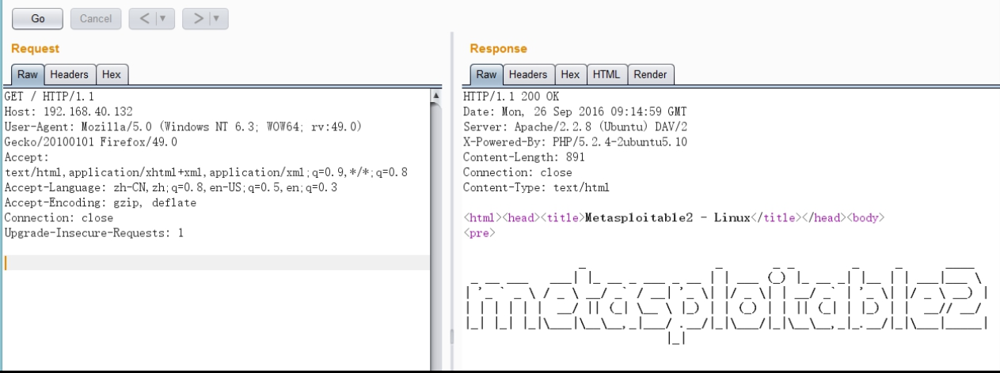

下面详细介绍左侧的Headers和Hex标签页。

Headers标签页既可以方便地添加HTTP头信息，又可以避免在手动修改HTTP头时因缺少空格等原因产生问题。例如，我们有时候会在CTF中遇到检查IP地址的题目，此时就可以添加X-Forwarded-For、X-Real-IP等HTTP头尝试绕过。在添加之后，可以在Raw标签页中发现这个新增加的HTTP头信息。

Hex标签页更多用于修改HTTP数据包的十六进制编码。比如，可以将其用在文件上传类型的CTF题目中以截断后缀，或者是使用这些编码来对WAF进行模糊测试，并让我们可以顺利上传Webshell，该部分的相关内容将会在后面的小节中提到。

### Intruder暴力破解模块

暴力破解（以下简称“爆破”）是一种低成本但可能带来高回报的攻击方式。大家应该了解过近些年出现的各种撞库漏洞。当然，在撞库的时候需要考虑性能和效率以进行多线程并发。这时候可以用Python或其他语言编写脚本进行撞库。Burp中也提供了简单易用的Intruder模块来进行爆破。

Intruder模块包含Sniper、Battering ram、Pitchfork、Cluster bomb等四种攻击类型，可以方便地进行Fuzz等测试。在Proxy等模块中，在想要测试的数据包上点击右键并选择Send to Intruder（或者Ctrl+l）即可将数据包发向Intruder模块。Intruder模块中包含了Target、Position、Payload、Options这四个标签页，可分别用于设置不同的功能，下面笔者将依次对其进行介绍。

在Target标签页中可以设置攻击目标的地址（Host）和目标端口（Port），并且可以选择是否使用HTTPS，如图1-6所示。

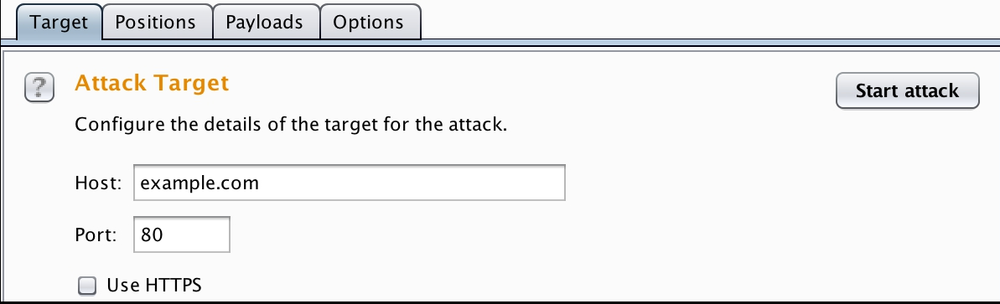

在Position标签页中可以设置攻击的位置和攻击的方法。攻击位置可以自动选择（一般自动选择的变量通常会比较多，不推荐自动选择）。手动选择的方法是：如果你的Burp已经进行了自动选择，那么先点击Clear§按钮，然后选择你要爆破的变量，再点击Add§按钮即可，如图1-7所示。

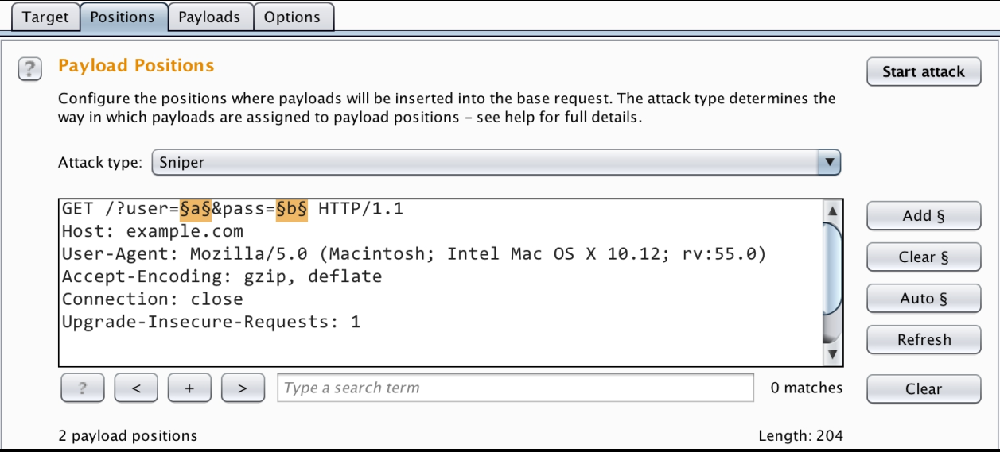

接下来笔者将介绍四种攻击类型（Attack type），下面以有两个要爆破的变量为例进行说明。

#### Sniper型

只需要设置一个Payload set，在两个变量的位置逐一替换Payload，每次只替换一个位置，先替换前面再替换后面。如果你的Payload set中有两个Payload，那么在爆破时会发送四次请求，结果如表1-1所示。

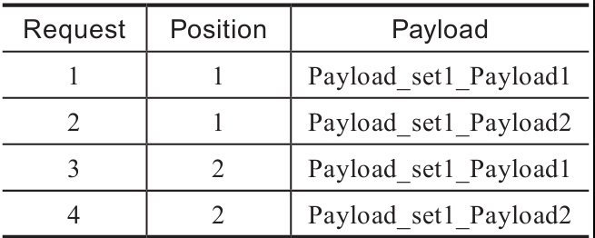

#### Battering ram型

只需要设置一个Payload set，在两个变量的位置同时替换相同的Payload。如果你的Payload set中有两个Payload，在爆破时会发送两次请求，结果如表1-2所示。


#### Pitchfork型

需要设置两个Payload set，这时候两个变量的位置和两个Payload set是一一对应的关系。这个类型可以用来进行撞库攻击等，用你已知的账号密码去测试其他网站。爆破时会发送两个请求，结果如表1-3所示。


#### Cluster bomb型

需要设置两个Payload set，这时候每个位置的Payload将在Payload set中进行排列组合。在爆破时共要发送2×2=4个请求，结果如表1-4所示。


接下来介绍Payload标签页，Payload set可用于设置每个位置使用的Payload集合。Payload type可用于设置这个Payload集合的内容。Payload type中常用的选项具体包含如下几种。

- Runtime file：用于从文件中加载Payload。
- Numbers：用于设置数字的开始和结束以及步长。
- Dates：用于设置日期及日期格式。
- Character blocks：用于设置长度爆破，Fuzz超长的Post变量，有时候可以绕过WAF等。

Burp 里面还提供了很多其他的 Payload 类型，请读者自行探索。

最后是 Options 标签页，在 Options 标签页中通常需要对 Request Engine 中的参数进行设置。第一个参数为线程数量，默认值为 1 ；第二个参数为网络连接失败时的重传次数，默认为三次；第三个参数为每次重传前的暂停时间；第四个参数为调节数据包发送速度的选项；第五个参数为开始时间。读者可以根据自己的电脑性能及网络状态等因素设置这些参数。

为了方便观察结果，一般会将响应信息按照请求的返回长度或响应状态码进行排序，或者在过滤器中设置匹配字符串或者正则表达式，以便对结果进行筛选和匹配。

### Decoder解码模块

Decoder 模块为我们提供了丰富的编码与解码工具，可以方便地对 HTTP/HTTPS 中需要的数据进行编码和解码，并且支持用文本格式或十六进制模式进行查看，如图 1-8 所示。

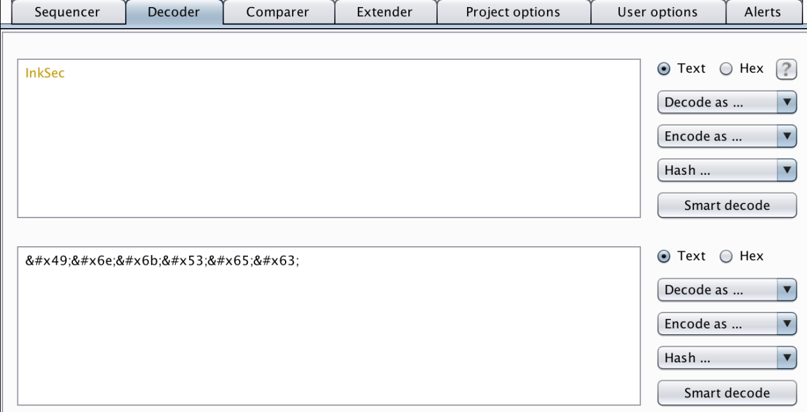

在这里，将需要处理的数据输入文本框中，然后选择编码或者解码的模式。除了编码和解码以外，Decoder模块还提供了如MD5、SHA等常见的哈希算法，十分方便。不过，在一般情况下笔者不推荐使用Smart decode进行解码，因为在CTF中智能解码一般都不准确。

### Comparer比较模块

在某些诸如Bool盲注的正确和错误的回显题目中，有时候两次数据包之间的差别很小，比较难发现，这时可以使用比较模块来进行比较，以发现差异，如图1-9所示。

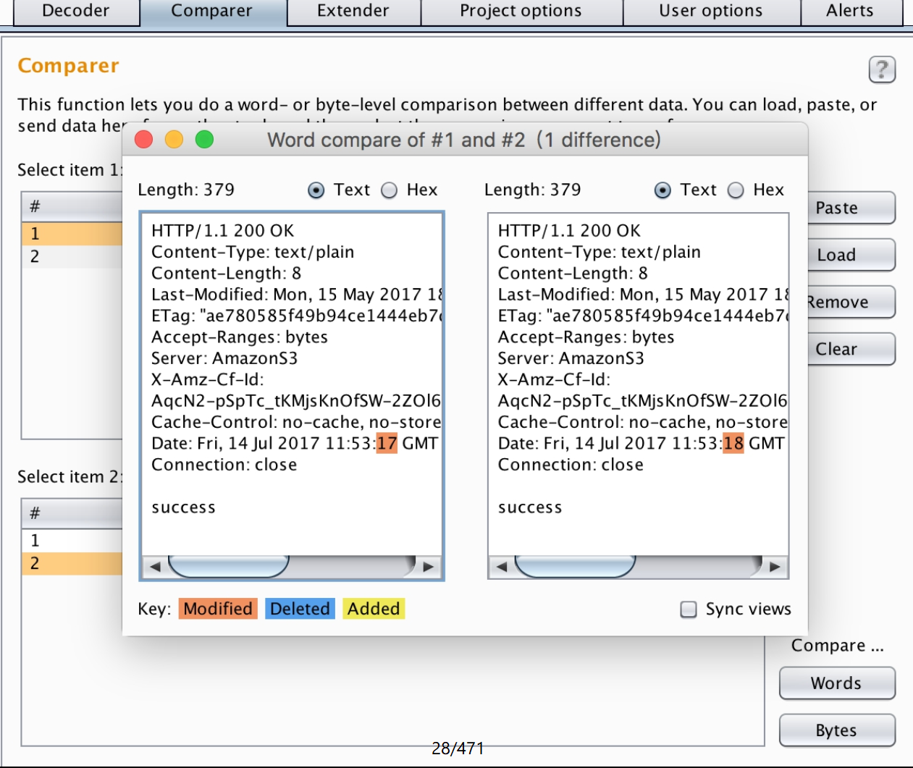

### 工程选项介绍

在工程选项中，这里只介绍一些比较常用的名称解析相关的模块，如图1-10所示。

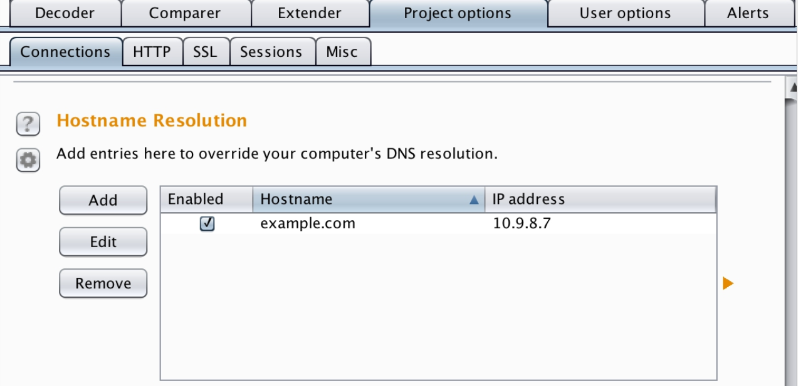

这里可以将域名（也可以是不存在的域名）与 IP 进行绑定，有时候会遇到一些有这方面需求的题目，而且后文中出现的 example.com 也都是在这里绑定的。

## Sqlmap

Sqlmap是一款开源的渗透测试工具，其可以自动检测并利用SQL注入漏洞。Sqlmap配备了强大的检测引擎，在CTF的Web类型的题目中经常会遇到注入类型的题目（见2.2节）。如果题目比较简单，甚至可以直接用Sqlmap得到flag。

但是，一般的题目还是需要进行绕过操作的，比如绕过空格或关键字检测等，这时候则可以调用Sqlmap的一些Tamper，或者自行编写Tamper来进行绕过，从而得到flag。

Sqlmap使用Python开发。

https://github.com/sqlmapproject/sqlmap.git

Sqlmap提供了强大的命令行功能，而且在Burp中也存在Sqlmap的插件。下面就来介绍一些基本的参数及其作用（见表1-5）。

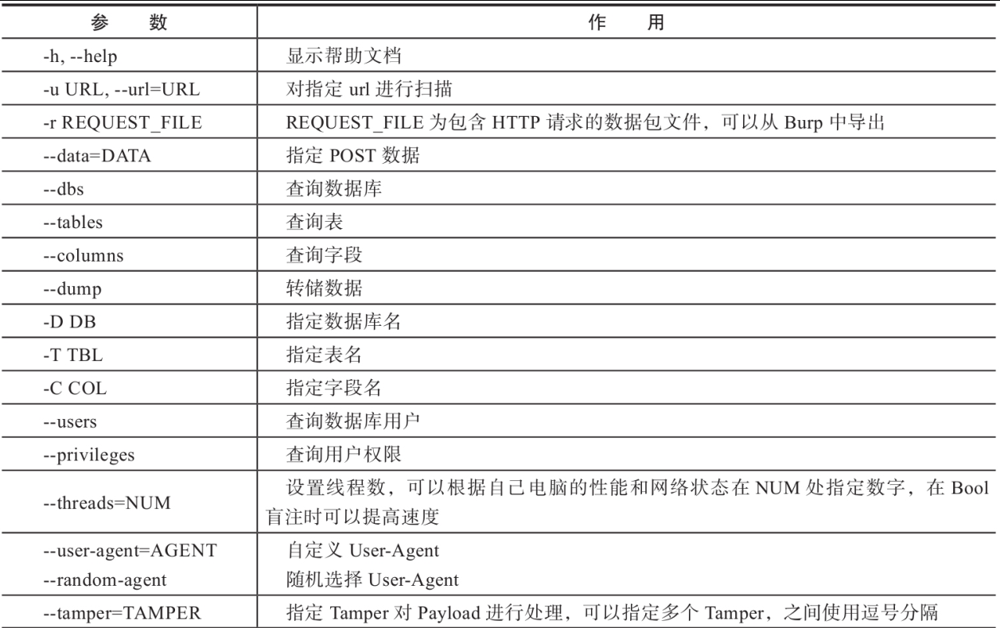

Tamper通常用来绕过一些过滤或者WAF，此处将为大家列举一些常见Tamper的功能（见表1-6）。这些Tamper脚本存放在Sqlmap目录下的tamper目录中，大家可以通过这些Tamper的代码学习一些绕过技巧（后面的章节也会介绍一些常见的绕过方法），或者是自己尝试编写有针对性的Tamper。


此外，Sqlmap还存在sqlmapapi.py，可以方便地通过API进行调度。更多的Sqlmap指令可在官方文档中找到，文档地址为：https://github.com/sqlmapproject/sqlmap/wiki。

## 浏览器与插件

这里推荐几个在日常和CTF比赛中比较常用的Chrome浏览器插件。

### Developer Tools

Developer Tools是Chrome浏览器自带的开发者工具，也是最常用到的功能，它集成Elements、Console、Sources、Network、Application等丰富的开发工具于一体，可以让Chrome对网页的元素、样式和脚本进行实时编辑、调试和监控。这里简单介绍一下常用面板的功能。

- Elements：查看网页源码经过浏览器渲染后的所有元素，可手动修改元素的属性和样式，并在浏览器中得到实时的反馈。
- Console：记录并显示开发者或浏览器输出的日志和调试信息，并可以作为与JS进行实时交互的命令行Shell。
- Sources：通常用于下断点调试JS。
- Network：记录发起请求后服务器响应的各种资源信息（包括状态码、资源类型、大小、耗时等），可以查看每个请求和响应的元信息。
- Application：记录网站加载的所有资源信息，包括存储数据（Local Storage、Session Storage、IndexedDB、Web SQL、Cookies）、缓存数据、字体、图片、脚本、样式表等。
- Security：从技术层面判断当前网页的安全性，如，是否有可疑代码、证书是否合法、通信链路是否安全等。注意，其并不能判断该网站是否为钓鱼网站或是否含有欺诈信息！

在CTF比赛中，需要处理JS相关的题目时，可以在Console面板中直接运行JS代码，而在XSS题目中，在Elements面板中可以方便地定位元素的位置等。

### Hasher

一款可以快速计算常见哈希算法（MD5/SHA1/HMAC/CRC等）、常用加密算法（AES/DES/RC4等）、编码转换（Base64/ROT13/HTML字符实体等）、网络地址转换、时间转换及进制转换等功能的工具，与前面Burp中的Decoder模块类似。

### Proxy SwitchyOmega

这是Chrome的一款代理插件，可以在多个代理配置文件之间快速切换。在前面的小节中我们说过，Burp切换代理时不是十分方便，这时候就可以将Burp与它结合，从而实现点击鼠标就能完成代理的切换。此外，在遇到内网渗透相关的题目时，打通socket隧道后也可以用它来让浏览器全局使用代理进行内网渗透。同时，它还可以配合“梯子”以实现科学上网。

### EditThisCookie

EditThisCookie是一个Cookie管理器，它可以方便地添加、删除、修改、查询和锁定站点的Cookies。这个插件可以配合XSS的题目使用，例如，当我们获得管理员的Cookies后，可以方便地修改这个站点的Cookies，从而以管理员的身份登录并进行后续获取flag的操作。

### User-Agent Switcher for Chrome

这款工具可以让我们方便地进行User-Agent的切换，这一点在某些限制User-Agent的题目中可能会用到，比如模拟微信客户端UA进行访问等。

### Wappalyzer

这款插件可以方便地查看当前站点的服务器型号、版本、服务器端语言等信息，可以帮我们进行一些初步的信息收集。不过，此处获取到的信息仅可作为参考，因为部分比赛题目会使用障眼法来影响你的判断，例如，Apache服务器返回了一个伪造的IIS头。

### SelectorGadget和XPath Helper

这两个插件都是用来定位、提取和选择指定元素的XPath，通常配合爬虫使用。

## Nmap

它的设计目标是快速地扫描大型网络，当然，用它扫描单个主机也没有问题。它可以使我们方便地发现网络上有哪些主机，这些主机可以提供什么服务（应用程序名和版本），这些服务运行在什么操作系统（包括版本信息）上。Nmap还可以探测到这些主机使用了什么类型的报文过滤器或防火墙，以及其他一些很有用的功能。下面就来简单介绍一下Nmap的基本命令和使用方法。Nmap的命令格式如下：

```shell
nmap [扫描类型][选项]{目标或目标集合}
```

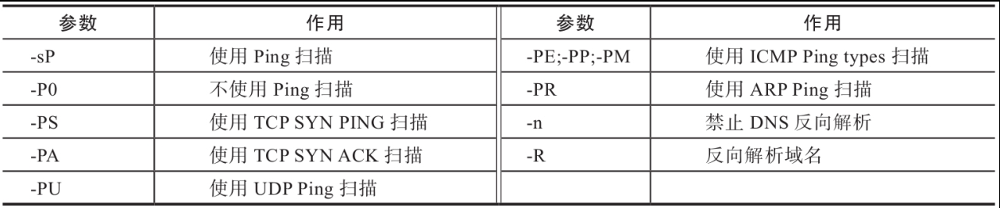

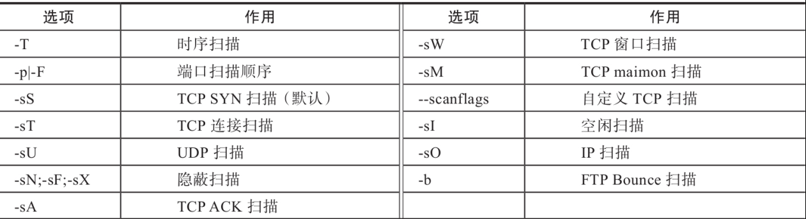

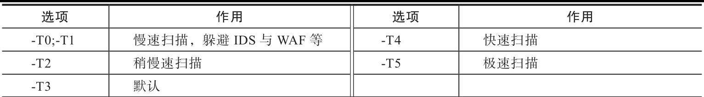


一般来说，如果我们输入命令nmap 192.168.1.1，实际上Nmap使用的是SYN扫描192.168.1.1开放率最高的1000个端口。

在实践中经常使用的扫描命令是：

```shell
nmap -sS -sV -p- 192.168.1.1
```

```shell
nmap -v -T4 -A 192.168.1.1/24
```

此外，Nmap扫描器还支持自定义扫描脚本（NSE），并提供了大量的常见服务的相关脚本，如SQL注入检测脚本、SMB漏洞扫描脚本、FTP爆破脚本等。

更加详细和全面的Nmap资料，大家可以在Nmap官网上获取，官方文档地址为：https://nmap.org/book/man.html。
