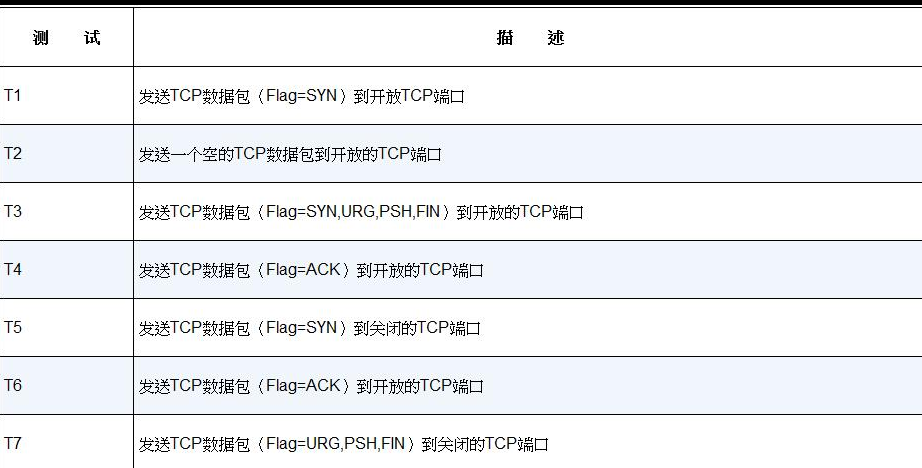

## Nmap 介绍

Nmap 的英文全称是“Network Mapper”，中文为“网络映射器”。Nmap 是一款开放源代码的网络探测和安全审核的工具，它的设计目标是快速地扫描大型网络，当然用它扫描单个主机也没有问题。Nmap 以新颖的方式使用原始 IP 报文来发现网络上有哪些主机，这些主机提供什么服务（应用程序名和版本），服务运行在什么操作系统（包括版本信息），它们使用什么类型的报文过滤器 / 防火墙，以及一些其他功能。虽然 Nmap 通常用于安全审核，许多系统管理员和网络管理员也用它来做一些日常的工作，比如查看整个网络的信息、管理服务升级计划，以及监视主机和服务的运行。

Nmap 的基本功能有 3 个，一是探测一组主机是否在线，其次是扫描主机端口，嗅探所提供的网络服务，还可以推断主机所用的操作系统。Nmap 可用于扫描仅有两个节点的 LAN，直至 500 个节点以上的网络。Nmap 还允许用户定制扫描技巧。通常，一个简单的使用 ICMP 协议的 Ping 操作可以满足一般需求；也可以深入探测 UDP 或者 TCP 端口，直至主机所使用的操作系统；还可以将所有探测结果记录到各种格式的日志中，供进一步分析操作。

Nmap 输出的是扫描目标的列表，以及每个目标的补充信息，至于是哪些信息则依赖于所使用的选项。Open（开放的）意味着目标机器上的应用程序正在该端口监听连接 / 报文。Filtered（被过滤的）意味着防火墙，过滤器或者其他网络障碍阻止了该端口被访问，Nmap 无法得知它是 Open（开放的）还是 Closed（关闭的）。Closed（关闭的）端口上面没有应用程序监听，但是它们随时可能开放。

Nmap —— Script 功能的使用。在 Nmap 的安装目录的 share/nmap/scripts 中，已经有多种写好的脚本提供，使用这些脚本可以轻易地发起渗透测试。

## Windows 下安装 Nmap

```shell
choco install nmap
```

## Nmap工作原理

Nmap 使用 TCP/IP 协议栈指纹准确地判断目标主机的操作系统类型，Nmap 工作原理如表 1.2 所示。



- T1 : 发送 TCP 数据包（Flag = SYN）到开放 TCP 端口
- T2 : 发送一个空的 TCP 数据包到开放的 TCP 端口
- T3 : 发送 TCP 数据包（Flag = SYN,URG,PSH,FIN）到开放的 TCP 端口
- T4 : 发送 TCP 数据包（Flag = ACK）到开放的 TCP 端口
- T5 : 发送 TCP 数据包（Flag = SYN）到关闭的 TCP 端口
- T6 : 发送 TCP 数据包（Flag = ACK）到开放的 TCP 端口
- T7 : 发送 TCP 数据包（Flag = URG,PSH,FIN）到关闭的 TCP 端口

如表1.2 所示，Nmap 对目标主机进行一系列的测试，利用测试结果建立相应目标主机的 Nmap 指纹，然后 Nmap 会对指纹进行匹配，最终输出相应的结果。

## Nmap语法

我们在使用 Nmap 的时候大多是在命令行下进行的，即使是使用可视化 Zenmap 也是需要遵循 Nmap 固定的语法格式的。Nmap 的固定语法格式如下：

```shell
Nmap【空格】【选项|多选项|协议】【空格】【目标】
```

其中，选项与多选项之间也是用空格进行分割的，如果某些选项需要指定某些数据，那么在这些选项与指定的数据之间也需要用空格进行分割。

## 全面扫描

Nmap 全面扫描的选项是 -A，它可以全面扫描指定 IP 或域名的所有端口及其目标系统信息等，这需要花费点时间等待 Nmap 的扫描。

```shell
$ root@root:~# nmap -A 192.168.4.171

Starting Nmap 7.92 ( https://nmap.org ) at 2022-04-02 02:50 EDT
Nmap scan report for 192.168.4.171
Host is up (0.00040s latency).
Not shown: 977 closed ports
PORT　　 STATE SERVICE　　 VERSION
21/tcp　 open　ftp　　　　 vsftpd 2.3.4　　#FTP服务商是vsftpd，版本是2.3.4
|_ftp-anon: Anonymous FTP login allowed (FTP code 230)　#允许匿名登录
22/tcp　 open　ssh　　　　 OpenSSH 4.7p1 Debian 8ubuntu1 (protocol 2.0) #SSH供应商是OpenSSH 版本是4.7
| ssh-hostkey: 1024 60:0f:cf:e1:c0:5f:6a:74:d6:90:24:fa:c4:d5:6c:cd (DSA)#秘钥
|_2048 56:56:24:0f:21:1d:de:a7:2b:ae:61:b1:24:3d:e8:f3 (RSA)
23/tcp　 open　telnet　　　Linux telnetd　　#Telnet服务
25/tcp　 open　smtp　　　　Postfix smtpd　　#Smtp服务
|_smtp-commands: metasploitable.localdomain, PIPELINING, SIZE 10240000, VRFY, ETRN, STARTTLS, ENHANCEDSTATUSCODES, 8BITMIME, DSN, 
| ssl-cert: Subject: commonName=ubuntu804-base.localdomain/organizationName=OCOSA/ stateOrProvinceName=There is no such thing outside US/countryName=XX
| Not valid before: 2010-03-17T14:07:45+00:00
|_Not valid after:　2010-04-16T14:07:45+00:00
|_ssl-date: 2014-06-10T10:00:54+00:00; -1d21h42m30s from local time.
53/tcp　 open　domain　　　ISC BIND 9.4.2　　#DNS服务端口

| dns-nsid: 
|_　bind.version: 9.4.2　　　　　　　　　　 
80/tcp　 open　http　　　　Apache httpd 2.2.8 ((Ubuntu) DAV/2)　 #HTTP服务
|_http-methods: No Allow or Public header in OPTIONS response (status code 200)
|_http-title: Metasploitable2 - Linux
111/tcp　open　rpcbind　　 2 (RPC #100000)　 #RPC服务
| rpcinfo:　　　　　　　　　　　　　　　　　　　 #RPC服务详细信息
|　 program version　 port/proto　service
|　 100000　2　　　　　　111/tcp　rpcbind
|　 100000　2　　　　　　111/udp　rpcbind
|　 100003　2,3,4　　　 2049/tcp　nfs
|　 100003　2,3,4　　　 2049/udp　nfs
|　 100005　1,2,3　　　40529/tcp　mountd
|　 100005　1,2,3　　　43983/udp　mountd
|　 100021　1,3,4　　　41255/tcp　nlockmgr
|　 100021　1,3,4　　　55723/udp　nlockmgr
|　 100024　1　　　　　35526/tcp　status
|_　100024　1　　　　　50609/udp　status
139/tcp　open　netbios-ssn Samba smbd 3.X (workgroup: WORKGROUP) #Samba版本为5.X
445/tcp　open　netbios-ssn Samba smbd 3.X (workgroup: WORKGROUP) #Samba版本为5.X
512/tcp　open　exec　　　　netkit-rsh rexecd
513/tcp　open　login?
514/tcp　open　tcpwrapped
1099/tcp open　rmiregistry GNU Classpath grmiregistry
|_rmi-dumpregistry: Registry listing failed (No return data received from server)
1524/tcp open　shell　　　 Metasploitable root shell
2049/tcp open　nfs　　　　 2-4 (RPC #100003)
2121/tcp open　ftp　　　　 ProFTPD 1.3.1
3306/tcp open　mysql　　　 MySQL 5.0.51a-3ubuntu5
| mysql-info: Protocol: 10
| Version: 5.0.51a-3ubuntu5
| Thread ID: 21
| Some Capabilities: Connect with DB, Compress, SSL, Transactions, Secure Connection
| Status: Autocommit
|_Salt: fRHP:oB9:Tvy|$:6@}uU
5432/tcp open　postgresql　PostgreSQL DB 8.3.0 - 8.3.7
5900/tcp open　vnc　　　　 VNC (protocol 3.3)
| vnc-info: 
|　 Protocol version: 3.3
|　 Security types:
|_　　Unknown security type (33554432)
6000/tcp open　X11　　　　 (access denied)
6667/tcp open　irc　　　　 Unreal ircd

| irc-info: 
|　 server: irc.Metasploitable.LAN
|　 version: Unreal3.2.8.1. irc.Metasploitable.LAN 
|　 servers: 1
|　 users: 1
|　 lservers: 0
|　 lusers: 1
|　 uptime: 0 days, 23:24:39
|　 source host: A5B014C0.D9689365.FFFA6D49.IP
|_　source ident: nmap
8009/tcp open　ajp13　　　 Apache Jserv (Protocol v1.3)
|_ajp-methods: Failed to get a valid response for the OPTION request
8180/tcp open　http　　　　Apache Tomcat/Coyote JSP engine 1.1
|_http-favicon: Apache Tomcat
|_http-methods: No Allow or Public header in OPTIONS response (status code 200)
|_http-title: Apache Tomcat/5.5
MAC Address: 00:0C:29:E0:2E:76 (VMware) 　　　#目标主机MAC地址
Device type: general purpose　　　　　　　　　　#设备类型
Running: Linux 2.6.X　　　　　　　　　　　 　　　#目标主机操作系统
OS CPE: cpe:/o:linux:linux_kernel:2.6　 　　　#目标主机中央处理单元
OS details: Linux 2.6.9 - 2.6.33　　　　　　　 #目标主机详细资料
Network Distance: 1 hop　　　　　　　　　　　　　#网络距离
Service Info: Hosts:　metasploitable.localdomain, localhost, irc.Metasploitable.LAN; OSs: Unix, Linux; CPE: cpe:/o:linux:linux_kernel

Host script results:
|_nbstat: NetBIOS name: METASPLOITABLE, NetBIOS user: , NetBIOS MAC: 
| smb-os-discovery:　　　　　　　　　　　　　　  #SMB系统发现
|　 OS: Unix (Samba 3.0.20-Debian)　　　　　　 #操作系统为Unix，Samba版本为2.0.20
|　 NetBIOS computer name:　　　　　　　　　　　#NetBIOS计算机名称
|　 Workgroup: WORKGROUP　　　　　　　　　　　　#所在工作组
|_　System time: 2015-06-10T06:00:51-04:00　  #系统时间

TRACEROUTE
HOP RTT　　 ADDRESS
1　 0.41 ms 192.168.4.171

OS and Service detection performed. Please report any incorrect results at http://nmap.org/submit/ .
Nmap done: 1 IP address (1 host up) scanned in 26.21 seconds
```

全面扫描又称作综合扫描，是一种完整扫描目标信息的扫描方式。

## 扫描指定段

在 Nmap 中我们可以指定扫描一个 C 段，这个功能不需要其他额外的选项，只需要使用“-”进行连接。

```shell
nmap 192.168.4.1-200
```
